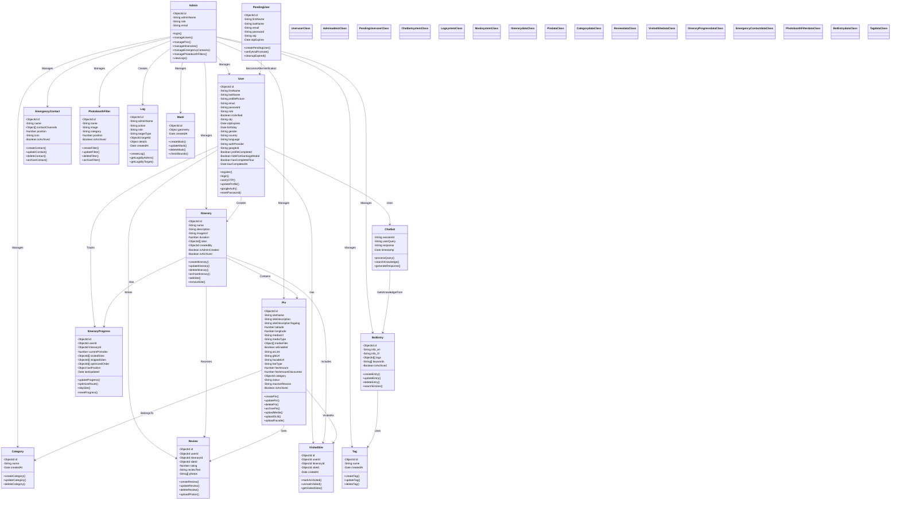

# Colored Juander Class Diagram

```mermaid
classDiagram
    class User {
        -ObjectId id
        -String firstName
        -String lastName
        -String profilePicture
        -String email
        -String password
        -String role
        -Boolean isVerified
        -String otp
        -Date otpExpires
        -Date birthday
        -String gender
        -String country
        -String language
        -String authProvider
        -String googleId
        -Boolean profileCompleted
        -Boolean hideFortSantiagoModal
        -Boolean hasCompletedTour
        -Date tourCompletedAt
        +register()
        +login()
        +verifyOTP()
        +updateProfile()
        +googleAuth()
        +resetPassword()
    }

    class Admin {
        -ObjectId id
        -String adminName
        -String role
        -String email
        +login()
        +manageUsers()
        +managePins()
        +manageItineraries()
        +manageEmergencyContacts()
        +managePhotoboothFilters()
        +viewLogs()
    }

    class Itinerary {
        -ObjectId id
        -String name
        -String description
        -String imageUrl
        -Number duration
        -ObjectId[] sites
        -ObjectId createdBy
        -Boolean isAdminCreated
        -Boolean isArchived
        +createItinerary()
        +updateItinerary()
        +deleteItinerary()
        +archiveItinerary()
        +addSite()
        +removeSite()
    }

    class Pin {
        -ObjectId id
        -String siteName
        -String siteDescription
        -String siteDescriptionTagalog
        -Number latitude
        -Number longitude
        -String mediaUrl
        -String mediaType
        -Object[] mediaFiles
        -Boolean arEnabled
        -String arLink
        -String glbUrl
        -String facadeUrl
        -String feeType
        -Number feeAmount
        -Number feeAmountDiscounted
        -ObjectId category
        -String status
        -String inactiveReason
        -Boolean isArchived
        +createPin()
        +updatePin()
        +deletePin()
        +archivePin()
        +uploadMedia()
        +uploadGLB()
        +uploadFacade()
    }

    class Category {
        -ObjectId id
        -String name
        -Date createdAt
        +createCategory()
        +updateCategory()
        +deleteCategory()
    }

    class Review {
        -ObjectId id
        -ObjectId userId
        -ObjectId itineraryId
        -ObjectId siteId
        -Number rating
        -String reviewText
        -String[] photos
        +createReview()
        +updateReview()
        +deleteReview()
        +uploadPhotos()
    }

    class VisitedSite {
        -ObjectId id
        -ObjectId userId
        -ObjectId itineraryId
        -ObjectId siteId
        -Date visitedAt
        +markAsVisited()
        +unmarkVisited()
        +getVisitedSites()
    }

    class ItineraryProgress {
        -ObjectId id
        -ObjectId userId
        -ObjectId itineraryId
        -Number currentPinIndex
        -ObjectId[] visitedSites
        -ObjectId[] skippedSites
        -ObjectId[] optimizedOrder
        -Object lastPosition
        -Date lastUpdated
        +updateProgress()
        +optimizeRoute()
        +skipSite()
        +resetProgress()
    }

    class EmergencyContact {
        -ObjectId id
        -String name
        -Object[] contactChannels
        -Number position
        -String icon
        -Boolean isArchived
        +createContact()
        +updateContact()
        +deleteContact()
        +archiveContact()
    }

    class PhotoboothFilter {
        -ObjectId id
        -String name
        -String image
        -String category
        -Number position
        -Boolean isArchived
        +createFilter()
        +updateFilter()
        +deleteFilter()
        +archiveFilter()
    }

    class Log {
        -ObjectId id
        -String adminName
        -String action
        -String role
        -String targetType
        -ObjectId targetId
        -Object details
        -Date createdAt
        +createLog()
        +getLogsByAdmin()
        +getLogsByTarget()
    }

    class BotEntry {
        -ObjectId id
        -String info_en
        -String info_fil
        -ObjectId[] tags
        -String[] keywords
        -Boolean isArchived
        +createEntry()
        +updateEntry()
        +deleteEntry()
        +searchEntries()
    }

    class Tag {
        -ObjectId id
        -String name
        -Date createdAt
        +createTag()
        +updateTag()
        +deleteTag()
    }

    class PendingUser {
        -ObjectId id
        -String firstName
        -String lastName
        -String email
        -String password
        -String otp
        -Date otpExpires
        +createPendingUser()
        +verifyAndPromote()
        +cleanupExpired()
    }

    class Mask {
        -ObjectId id
        -Object geometry
        -Date createdAt
        +createMask()
        +updateMask()
        +deleteMask()
        +checkBounds()
    }

    class Chatbot {
        -String sessionId
        -String userQuery
        -String response
        -Date timestamp
        +processQuery()
        +searchKnowledge()
        +generateResponse()
    }

    %% Color styling
    classDef userClass fill:#E3F2FD,stroke:#1976D2,stroke-width:2px,color:#000
    classDef adminClass fill:#FFF3E0,stroke:#F57C00,stroke-width:2px,color:#000
    classDef systemClass fill:#F3E5F5,stroke:#7B1FA2,stroke-width:2px,color:#000
    classDef dataClass fill:#E8F5E8,stroke:#388E3C,stroke-width:2px,color:#000

    class User userClass
    class Admin adminClass
    class PendingUser userClass
    class Chatbot systemClass
    class Log systemClass
    class Mask systemClass
    class Itinerary dataClass
    class Pin dataClass
    class Category dataClass
    class Review dataClass
    class VisitedSite dataClass
    class ItineraryProgress dataClass
    class EmergencyContact dataClass
    class PhotoboothFilter dataClass
    class BotEntry dataClass
    class Tag dataClass

    Admin --> User : Manages
    Admin --> Pin : Manages
    Admin --> Itinerary : Manages
    Admin --> EmergencyContact : Manages
    Admin --> PhotoboothFilter : Manages
    Admin --> Category : Manages
    Admin --> BotEntry : Manages
    Admin --> Tag : Manages
    Admin --> Mask : Manages
    Admin --> Log : Creates

    User --> Itinerary : Creates
    User --> Review : Writes
    User --> VisitedSite : Has
    User --> ItineraryProgress : Tracks
    User --> Chatbot : Uses

    Itinerary --> Pin : Contains
    Itinerary --> Review : Receives
    Itinerary --> VisitedSite : Includes
    Itinerary --> ItineraryProgress : Has

    Pin --> Category : BelongsTo
    Pin --> Review : Gets
    Pin --> VisitedSite : VisitedAs

    BotEntry --> Tag : Uses
    Chatbot --> BotEntry : GetsKnowledgeFrom

    PendingUser --> User : BecomesAfterVerification
```
