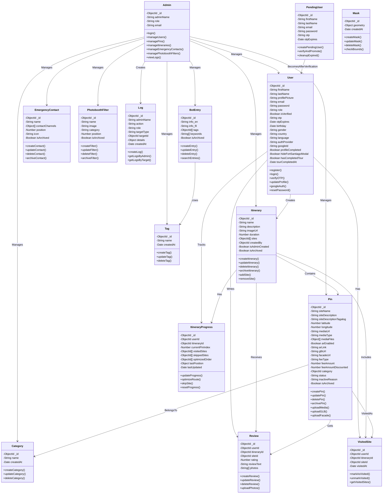

# Updated Juander Backend Class Diagram

```mermaid
classDiagram
    class User {
        -ObjectId _id
        -String firstName
        -String lastName
        -String profilePicture
        -String email
        -String password
        -String role
        -Boolean isVerified
        -String otp
        -Date otpExpires
        -Date birthday
        -String gender
        -String country
        -String language
        -String authProvider
        -String googleId
        -Boolean profileCompleted
        -Boolean hideFortSantiagoModal
        -Boolean hasCompletedTour
        -Date tourCompletedAt
        +register()
        +login()
        +verifyOTP()
        +updateProfile()
        +googleAuth()
        +resetPassword()
    }

    class Admin {
        -ObjectId _id
        -String adminName
        -String role
        -String email
        +login()
        +manageUsers()
        +managePins()
        +manageItineraries()
        +manageEmergencyContacts()
        +managePhotoboothFilters()
        +viewLogs()
    }

    class Itinerary {
        -ObjectId _id
        -String name
        -String description
        -String imageUrl
        -Number duration
        -ObjectId[] sites
        -ObjectId createdBy
        -Boolean isAdminCreated
        -Boolean isArchived
        +createItinerary()
        +updateItinerary()
        +deleteItinerary()
        +archiveItinerary()
        +addSite()
        +removeSite()
    }

    class Pin {
        -ObjectId _id
        -String siteName
        -String siteDescription
        -String siteDescriptionTagalog
        -Number latitude
        -Number longitude
        -String mediaUrl
        -String mediaType
        -Object[] mediaFiles
        -Boolean arEnabled
        -String arLink
        -String glbUrl
        -String facadeUrl
        -String feeType
        -Number feeAmount
        -Number feeAmountDiscounted
        -ObjectId category
        -String status
        -String inactiveReason
        -Boolean isArchived
        +createPin()
        +updatePin()
        +deletePin()
        +archivePin()
        +uploadMedia()
        +uploadGLB()
        +uploadFacade()
    }

    class Category {
        -ObjectId _id
        -String name
        -Date createdAt
        +createCategory()
        +updateCategory()
        +deleteCategory()
    }

    class Review {
        -ObjectId _id
        -ObjectId userId
        -ObjectId itineraryId
        -ObjectId siteId
        -Number rating
        -String reviewText
        -String[] photos
        +createReview()
        +updateReview()
        +deleteReview()
        +uploadPhotos()
    }

    class VisitedSite {
        -ObjectId _id
        -ObjectId userId
        -ObjectId itineraryId
        -ObjectId siteId
        -Date visitedAt
        +markAsVisited()
        +unmarkVisited()
        +getVisitedSites()
    }

    class ItineraryProgress {
        -ObjectId _id
        -ObjectId userId
        -ObjectId itineraryId
        -Number currentPinIndex
        -ObjectId[] visitedSites
        -ObjectId[] skippedSites
        -ObjectId[] optimizedOrder
        -Object lastPosition
        -Date lastUpdated
        +updateProgress()
        +optimizeRoute()
        +skipSite()
        +resetProgress()
    }

    class EmergencyContact {
        -ObjectId _id
        -String name
        -Object[] contactChannels
        -Number position
        -String icon
        -Boolean isArchived
        +createContact()
        +updateContact()
        +deleteContact()
        +archiveContact()
    }

    class PhotoboothFilter {
        -ObjectId _id
        -String name
        -String image
        -String category
        -Number position
        -Boolean isArchived
        +createFilter()
        +updateFilter()
        +deleteFilter()
        +archiveFilter()
    }

    class Log {
        -ObjectId _id
        -String adminName
        -String action
        -String role
        -String targetType
        -ObjectId targetId
        -Object details
        -Date createdAt
        +createLog()
        +getLogsByAdmin()
        +getLogsByTarget()
    }

    class BotEntry {
        -ObjectId _id
        -String info_en
        -String info_fil
        -ObjectId[] tags
        -String[] keywords
        -Boolean isArchived
        +createEntry()
        +updateEntry()
        +deleteEntry()
        +searchEntries()
    }

    class Tag {
        -ObjectId _id
        -String name
        -Date createdAt
        +createTag()
        +updateTag()
        +deleteTag()
    }

    class PendingUser {
        -ObjectId _id
        -String firstName
        -String lastName
        -String email
        -String password
        -String otp
        -Date otpExpires
        +createPendingUser()
        +verifyAndPromote()
        +cleanupExpired()
    }

    class Mask {
        -ObjectId _id
        -Object geometry
        -Date createdAt
        +createMask()
        +updateMask()
        +deleteMask()
        +checkBounds()
    }

    %% Admin Management Relationships
    Admin --> User : Manages
    Admin --> Pin : Manages  
    Admin --> Itinerary : Manages
    Admin --> EmergencyContact : Manages
    Admin --> PhotoboothFilter : Manages
    Admin --> Category : Manages
    Admin --> BotEntry : Manages
    Admin --> Tag : Manages
    Admin --> Log : Creates

    %% User Relationships
    User --> Itinerary : Creates
    User --> Review : Writes
    User --> VisitedSite : Has
    User --> ItineraryProgress : Tracks

    %% Itinerary Relationships  
    Itinerary --> Pin : Contains
    Itinerary --> Review : Receives
    Itinerary --> VisitedSite : Includes
    Itinerary --> ItineraryProgress : Has

    %% Pin Relationships
    Pin --> Category : BelongsTo
    Pin --> Review : Gets
    Pin --> VisitedSite : VisitedAs

    %% Bot Relationships
    BotEntry --> Tag : Uses

    %% Authentication Flow
    PendingUser --> User : BecomesAfterVerification
```
